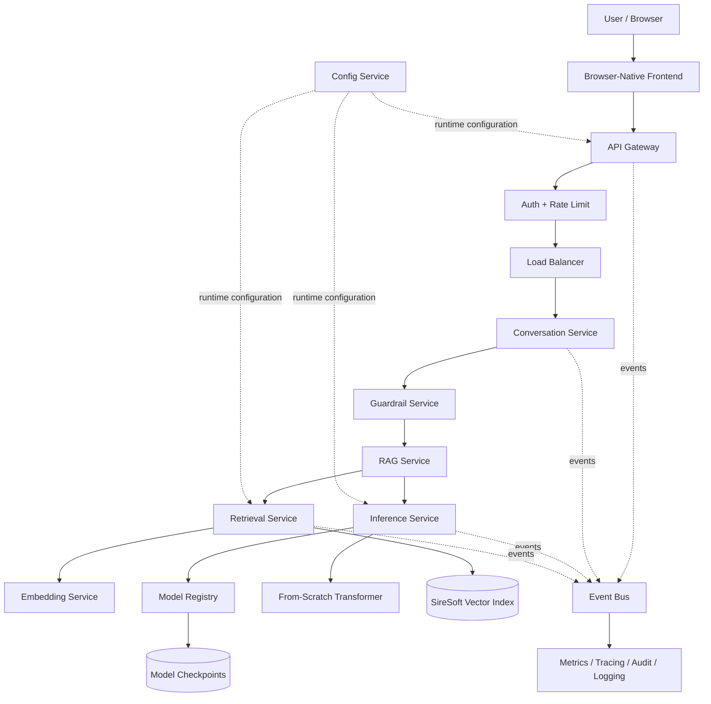
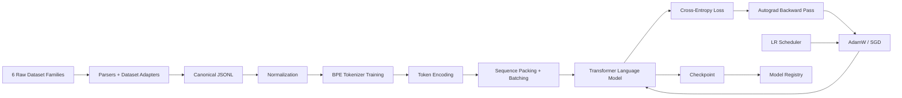
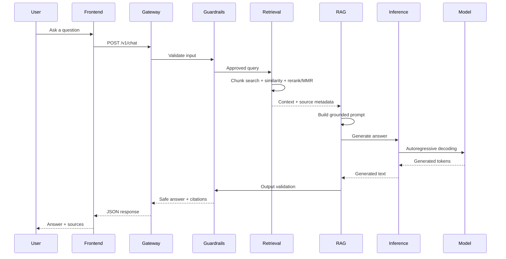
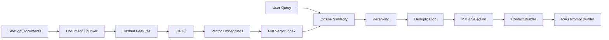

<p align="center">
  <a href="https://www.siresoft.net/" target="_blank">
    
  </a>
</p>

<h1 align="center">SireLLM</h1>

<p align="center">
  <strong>Independent, from-scratch Language Model + Retrieval-Augmented Generation platform for SireSoft</strong>
</p>

<p align="center">
  Built without external LLM APIs, pretrained model weights, or third-party ML/NLP frameworks.
</p>

<p align="center">
  <a href="https://www.siresoft.net/"></a>
  
  
  
  
  
  
</p>

<p align="center">
  <a href="https://www.siresoft.net/">SireSoft Website</a>
  ·
  <a href="https://github.com/SireSoft-USA/independant_chatbot">Repository</a>
</p>

---

## Table of Contents

- [Overview](#overview)
- [Project Status](#project-status)
- [Design Goals](#design-goals)
- [System Architecture](#system-architecture)
- [End-to-End Workflow](#end-to-end-workflow)
- [Machine Learning Stack](#machine-learning-stack)
- [Retrieval-Augmented Generation](#retrieval-augmented-generation)
- [Service Architecture](#service-architecture)
- [Runtime Architecture](#runtime-architecture)
- [Configuration Layer](#configuration-layer)
- [Frontend](#frontend)
- [Datasets](#datasets)
- [Dataset Licensing](#dataset-licensing)
- [Repository Structure](#repository-structure)
- [Real Execution Guide](#real-execution-guide)
- [Generated Artifacts](#generated-artifacts)
- [API Surface](#api-surface)
- [Security and Guardrails](#security-and-guardrails)
- [Observability and Operations](#observability-and-operations)
- [Validation](#validation)
- [Git and Large-File Policy](#git-and-large-file-policy)
- [Engineering Constraints](#engineering-constraints)
- [Known Operational Characteristics](#known-operational-characteristics)
- [Roadmap](#roadmap)
- [Third-Party Notices](#third-party-notices)
- [License and Ownership](#license-and-ownership)

---

## Overview

**SireLLM** is an independent chatbot and language-model platform built for **SireSoft**.

The project implements the major components of an LLM stack directly in the repository:

- data parsing and canonical preprocessing
- text normalization
- byte/BPE tokenization
- dense tensor operations
- automatic differentiation
- neural-network primitives
- Transformer decoder blocks
- causal language modeling
- cross-entropy loss
- SGD and AdamW optimization
- warmup and cosine learning-rate schedules
- sequence batching and padding
- checkpoint persistence
- autoregressive inference
- document chunking
- TF-IDF-style hashed embeddings
- cosine similarity
- flat vector indexing
- ranking, deduplication and MMR
- RAG prompt/context construction
- input/context/output guardrails
- conversation management
- API protocol and gateway
- microservice orchestration
- runtime composition
- health, monitoring, metrics and tracing
- browser-native frontend
- repository diagnostics and integration validation

The system is designed so that **training, inference and retrieval can run locally without calling an external LLM provider**.

> [!IMPORTANT]
> SireLLM uses the Python standard library where operating-system, filesystem, networking, process, concurrency and persistence functionality is required. The restriction is against third-party ML/NLP/model dependencies—not against necessary Python standard-library functionality.

---

## Project Status

Current validated repository snapshot:

| Check | Status |
|---|---:|
| Planned internal architecture | **117 / 117 folders** |
| Direct folder-level validation coverage | **117 / 117** |
| Python files parsed by repository diagnosis | **695** |
| Unknown third-party Python import roots | **0** |
| Frontend contract | **Validated** |
| API gateway contract | **Validated** |
| Local asset contract | **Validated** |
| Real preprocessing runner | **Available** |
| Real tokenizer-training runner | **Available** |
| Real model-training runner | **Available** |
| Custom CUDA training backend | **Available** |
| GPU training smoke test | **Available** |
| Resumable batch checkpoints | **Available** |
| Live training visualization | **Available** |
| Real retrieval-index runner | **Available** |
| Local generation runner | **Available** |
| RAG chat runner | **Available** |

The repository source architecture is complete. Runtime artifacts such as canonical datasets, tokenizer state, trained model checkpoints and retrieval indexes are generated locally and intentionally excluded from Git.

---

## Design Goals

SireLLM is built around the following engineering constraints:

1. **No external LLM APIs**
   - no OpenAI inference dependency
   - no Groq inference dependency
   - no OpenRouter inference dependency
   - no hosted model dependency

2. **No pretrained model weights**
   - the language model begins from repository-defined initialization
   - model parameters are learned through the local training pipeline

3. **No third-party ML/NLP frameworks**
   - no PyTorch
   - no TensorFlow
   - no Keras
   - no scikit-learn
   - no NumPy-based model implementation
   - no Hugging Face Transformers runtime
   - no external tokenizer library
   - no external vector database

4. **Handwritten ML pipeline**
   - tensor math
   - autograd
   - neural layers
   - attention
   - Transformer
   - optimization
   - tokenization
   - retrieval
   - RAG orchestration

5. **Professional modular architecture**
   - clear separation between libraries, services, runtime, configs, persistence, frontend and developer tooling

6. **Data preservation**
   - immutable raw-data layer
   - canonical normalized layer
   - provenance preservation
   - source metadata retention
   - preprocessing history
   - no blind concatenation of heterogeneous datasets

---

## System Architecture



---

## End-to-End Workflow

### Training path



### Request path



---

## Machine Learning Stack

### Core mathematical layer

The low-level stack includes custom implementations for:

- scalar mathematical functions
- deterministic pseudo-random generation
- dense tensors
- tensor reshaping
- indexing
- reductions
- transpose
- matrix multiplication
- serialization
- automatic differentiation
- gradient propagation

### Neural-network layer

`libs/neural/` contains:

- base layer abstractions
- trainable parameters
- linear layers
- embeddings
- layer normalization
- activations
- dropout
- weight initialization

### Transformer layer

`libs/transformer/` contains:

- causal masking
- attention
- multi-head attention
- rotary embeddings
- positional encoding
- feed-forward blocks
- Transformer blocks
- decoder stack
- language-model head
- generation helpers

### Training layer

`libs/training/` contains:

- cross entropy
- softmax
- SGD
- AdamW
- constant schedules
- warmup schedules
- cosine schedules
- padding
- sequence packing
- batch construction
- gradient clipping
- trainer
- evaluator
- checkpoint management

### Inference layer

`libs/inference/` contains:

- sampling
- logits processing
- generation state
- KV cache
- autoregressive generation

---

## Retrieval-Augmented Generation

SireLLM includes a completely local retrieval stack for grounding answers in SireSoft knowledge.

### Retrieval flow



### Retrieval components

The stack includes:

- token-aware document chunking
- character-overlap control
- document/source metadata
- hashed feature generation
- inverse-document-frequency weighting
- cosine similarity
- batch similarity
- flat vector index
- persistence
- reranking
- duplicate suppression
- maximal marginal relevance
- citation objects
- context-window construction
- grounded prompt generation

Primary SireSoft retrieval artifacts are stored locally under:

```text
vector_store/
├── indexes/
└── siresoft/
```

Generated index files are not committed to Git.

---

## Service Architecture

The service layer separates business responsibilities into independently testable units.

| Service | Responsibility |
|---|---|
| `api_gateway` | Public `/v1/*` protocol boundary |
| `load_balancer` | Strategy-based service-instance dispatch |
| `dataset_service` | Dataset access and inventory |
| `preprocessing_service` | Raw-to-canonical transformation |
| `tokenizer_service` | Tokenizer lifecycle and persistence |
| `training_service` | Training jobs, factories and epochs |
| `model_registry` | Versioned checkpoint registration |
| `inference_service` | Model loading and generation runtime |
| `embedding_service` | Embedding state and generation |
| `retrieval_service` | Document store, vector retrieval and persistence |
| `rag_service` | Retrieval/inference orchestration |
| `guardrail_service` | Input/context/output policy |
| `conversation_service` | Session and context-window management |
| `monitoring_service` | Runtime monitoring |
| `auth_service` | Authentication boundary |
| `rate_limit_service` | Request-rate control |
| `cache_service` | Service caching |
| `logging_service` | Structured logging |
| `config_service` | Runtime configuration state |
| `service_discovery` | Runtime service-instance discovery |
| `event_bus` | Topic-based event delivery |
| `job_queue` | Queueing, leases, retries and dead-letter handling |
| `scheduler_service` | Scheduled/recurring work dispatch |
| `notification_service` | Notification templates and transports |
| `audit_service` | Append-only audit records |
| `metrics_service` | Runtime metrics |
| `tracing_service` | Trace propagation |
| `feature_flag_service` | Runtime feature control |
| `secret_service` | Secret handling boundary |

---

## Runtime Architecture

The runtime layer turns individual modules and services into a working application.

It includes:

- networking
- concurrency
- process control
- storage
- lifecycle hooks
- bootstrap
- HTTP client/server primitives
- service host
- health checks
- signal handling
- observability
- diagnostics
- recovery
- maintenance
- control plane
- service composition
- entrypoint
- CLI
- server runtime
- daemon runtime

The runtime composition layer is responsible for resolving dependencies and connecting service instances without forcing implementation modules to become standalone scripts.

---

## Configuration Layer

Every major subsystem has a dedicated configuration package under `configs/`.

Configuration domains include:

- runtime
- services
- gateway
- authentication
- rate limiting
- caching
- logging
- metrics
- tracing
- feature flags
- secrets
- model registry
- training
- inference
- retrieval
- RAG
- safety
- datasets
- preprocessing
- tokenizer
- embedding
- conversation
- monitoring
- service discovery
- event bus
- job queue
- scheduler
- notification
- audit
- load balancer
- config service

Configuration handling includes typed configuration objects, handwritten JSON decoding, source/layer precedence and secret-redaction boundaries.

---

## Frontend

The frontend is intentionally dependency-light and browser-native.

```text
frontend/
├── index.html
├── README.md
├── test_frontend_shell.py
├── css/
│   ├── app.css
│   └── test_frontend_css.py
├── js/
│   ├── api.js
│   ├── app.js
│   ├── chat.js
│   ├── state.js
│   ├── stream.js
│   └── test_frontend_js.py
└── assets/
    ├── asset_manifest.json
    ├── empty-chat.svg
    ├── favicon.svg
    ├── sirellm-mark.svg
    ├── source-document.svg
    ├── README.md
    └── test_frontend_assets.py
```

<p align="center">
  
</p>

Frontend characteristics:

- semantic HTML
- handwritten CSS
- native ES modules
- browser `fetch`
- no framework runtime
- no CDN dependency
- no React/Vue/Angular requirement
- safe DOM text rendering
- citations panel
- session state
- health-state display
- request cancellation
- trace/correlation IDs
- responsive layouts
- reduced-motion handling
- high-contrast support

---

## Datasets

SireLLM is designed around **six dataset families**.

> [!WARNING]
> Raw datasets and canonical generated datasets are intentionally excluded from Git. They must remain local or be obtained from their original distribution sources.

### 1. DailyDialog

Purpose:

- everyday multi-turn conversation
- dialogue acts
- conversational flow
- natural short-form responses

Expected raw files:

```text
datasets/raw/dailydialog/
├── dialogues.json
└── ontology.json
```

Canonical output:

```text
datasets/canonical/dailydialog.jsonl
```

---

### 2. Databricks Dolly 15K

Purpose:

- instruction following
- brainstorming
- classification
- QA
- generation
- information extraction
- summarization

Expected raw file:

```text
datasets/raw/dolly/
└── databricks-dolly-15k.jsonl
```

Canonical output:

```text
datasets/canonical/dolly.jsonl
```

---

### 3. Cornell Movie-Dialogs Corpus / ConvoKit distribution

Purpose:

- conversational turns
- dialogue continuity
- speaker-response patterns
- varied fictional conversational language

Expected raw files:

```text
datasets/raw/movie-corpus/
├── conversations.json
├── corpus.json
├── index.json
├── speakers.json
└── utterances.jsonl
```

The preprocessing loader supports the ConvoKit-style layout where conversation metadata may be keyed by conversation ID while utterances are stored in JSONL and linked through `conversation_id`.

Canonical output:

```text
datasets/canonical/movie-corpus.jsonl
```

---

### 4. SireSoft Knowledge Corpus

Purpose:

- company-specific grounding
- products and services
- company information
- internal/approved knowledge
- primary RAG source

Expected raw file:

```text
datasets/raw/siresoft/
└── siresoft.txt
```

On Windows, an existing checkout may display the filename as `SireSoft.txt`; keep the configured path consistent if the repository is moved to a case-sensitive filesystem.

Canonical output:

```text
datasets/canonical/siresoft.jsonl
```

---

### 5. TinyStories

Purpose:

- basic language-model pretraining
- grammatical structure
- short-form causal text generation
- learning coherent local token patterns

Expected raw file:

```text
datasets/raw/tinystories/
└── TinyStories-train.txt
```

Canonical output:

```text
datasets/canonical/tinystories.jsonl
```

---

### 6. OpenAssistant OASST1

Purpose:

- assistant-style conversation
- multi-turn question/answer behavior
- human conversational preference data
- broader instruction/assistant behavior

Source + extracted working file:

```text
datasets/raw/openassistant/
├── source/
│   └── 2023-04-12_oasst_ready.messages.jsonl.gz
└── oasst1-ready.jsonl
```

The preprocessing pipeline consumes the extracted `oasst1-ready.jsonl`.

Canonical output:

```text
datasets/canonical/openassistant.jsonl
```

---

## Dataset Licensing

**SireSoft's proprietary project license does not replace or override third-party dataset licenses.**

| Dataset | Upstream license / status | Project handling |
|---|---|---|
| DailyDialog | **CC BY-NC-SA 4.0** | Keep separate attribution and non-commercial restriction in mind |
| Databricks Dolly 15K | **CC BY-SA 3.0** | Attribution/share-alike obligations remain applicable |
| Cornell Movie-Dialogs Corpus | Refer to the original Cornell/ConvoKit distribution terms | Not relicensed by SireSoft |
| TinyStories | **CDLA-Sharing-1.0** | Upstream data terms remain applicable |
| OpenAssistant OASST1 | **Apache-2.0** | Preserve upstream notices where required |
| SireSoft corpus | **SireSoft proprietary/internal material** | Governed by SireSoft authorization and policy |

> [!CAUTION]
> **DailyDialog is published under a non-commercial license.** Any commercial use, model-training decision or distribution involving that dataset should be reviewed separately before production deployment.

Upstream references:

- DailyDialog: https://huggingface.co/datasets/roskoN/dailydialog
- Databricks Dolly 15K: https://huggingface.co/datasets/databricks/databricks-dolly-15k
- Cornell Movie-Dialogs: https://www.cs.cornell.edu/~cristian/Cornell_Movie-Dialogs_Corpus.html
- ConvoKit Movie Corpus: https://convokit.cornell.edu/documentation/movie.html
- TinyStories: https://huggingface.co/datasets/roneneldan/TinyStories
- OpenAssistant OASST1: https://huggingface.co/datasets/OpenAssistant/oasst1

---

## Repository Structure

### Top-level map

```text
independant_chatbot/
│
├── configs/                # Typed configuration for the entire platform
├── datasets/               # Local raw/canonical data; ignored by Git
├── frontend/               # Browser-native SireLLM UI
├── libs/                   # Handwritten ML/NLP/RAG foundations
├── model_store/            # Local model checkpoint/manifests
├── runtime/                # Process, server, lifecycle and composition
├── services/               # Microservice/business capability layer
├── tests/                  # Repository-level integration validation
├── tools/                  # Developer + real execution tooling
├── vector_store/           # Local SireSoft retrieval artifacts
│
├── .gitignore
├── LICENSE
└── README.md
```

<details>
<summary><strong>Full 117-folder internal architecture</strong></summary>

```text
libs/
├── core/
│   ├── collections/
│   ├── math/
│   ├── autograd/
│   └── serialization/
├── data/
│   ├── parsers/
│   ├── schema/
│   ├── adapters/
│   └── streaming/
├── nlp/
│   ├── normalization/
│   ├── tokenizer/
│   └── corpus/
├── neural/
├── transformer/
├── training/
│   ├── losses/
│   ├── optimizers/
│   ├── schedules/
│   └── batching/
├── inference/
├── retrieval/
│   ├── chunking/
│   ├── embedding/
│   ├── similarity/
│   ├── index/
│   └── ranking/
├── rag/
├── safety/
└── protocol/

services/
├── api_gateway/
├── load_balancer/
├── dataset_service/
├── preprocessing_service/
├── tokenizer_service/
├── training_service/
├── model_registry/
├── inference_service/
├── embedding_service/
├── retrieval_service/
├── rag_service/
├── guardrail_service/
├── conversation_service/
├── monitoring_service/
├── auth_service/
├── rate_limit_service/
├── cache_service/
├── logging_service/
├── config_service/
├── service_discovery/
├── event_bus/
├── job_queue/
├── scheduler_service/
├── notification_service/
├── audit_service/
├── metrics_service/
├── tracing_service/
├── feature_flag_service/
└── secret_service/

model_store/
├── checkpoints/
└── manifests/

vector_store/
├── siresoft/
└── indexes/

runtime/
├── networking/
├── concurrency/
├── processes/
├── storage/
├── lifecycle/
├── bootstrap/
├── http/
├── service_host/
├── health/
├── signals/
├── observability/
├── diagnostics/
├── recovery/
├── maintenance/
├── control_plane/
├── composition/
├── entrypoint/
├── cli/
├── server/
└── daemon/

configs/
├── runtime/
├── services/
├── gateway/
├── auth/
├── rate_limit/
├── cache/
├── logging/
├── metrics/
├── tracing/
├── feature_flags/
├── secrets/
├── model_registry/
├── training/
├── inference/
├── retrieval/
├── rag/
├── safety/
├── datasets/
├── preprocessing/
├── tokenizer/
├── embedding/
├── conversation/
├── monitoring/
├── service_discovery/
├── event_bus/
├── job_queue/
├── scheduler/
├── notification/
├── audit/
├── load_balancer/
└── config_service/

frontend/
├── css/
├── js/
└── assets/

tools/

tests/
```

</details>

---

## Real Execution Guide

Production deployment now uses a **precompiled CUDA backend**. The GPU server
never runs `nvcc` and never installs/builds a CUDA Toolkit. The recommended
server command is simply:

```bash
python run_pipeline.py
```

The pipeline defaults to strict `cuda` mode, so it will stop before full
training if GPU execution cannot be proven. It will not silently train for
hours on CPU. For a laptop without NVIDIA hardware, use:

```bash
python run_pipeline.py --device cpu
```

### Build the CUDA backend before deployment

The Quadro P5000 target is Pascal `sm_61`. The repository includes:

```text
.github/workflows/build-cuda-backend.yml
```

After you push CUDA/source changes to `main`, GitHub Actions compiles the Linux
backend with CUDA 12.x, validates its exported API, creates source-hash build
metadata, uploads an Actions artifact, and commits these files back to `main`:

```text
libs/core/gpu/libsireikon_cuda.so
libs/core/gpu/libsireikon_cuda.build.json
```

A GPU is **not required for compilation**. If you prefer to compile manually,
use Linux/WSL x86_64 with CUDA Toolkit 12.x:

```bash
python tools/build_cuda_backend.py --arch sm_61 --required
```

Do not compile the deployment backend directly as a native Windows DLL; the
server requires a Linux `.so`.

### GPU readiness test

After the GitHub workflow has committed the prebuilt backend, the server only
needs to pull it and test runtime CUDA:

```bash
git pull origin main
python tools/cuda_status.py --arch sm_61
python tools/test_gpu_training.py --arch sm_61 --require-cuda
```

A successful strict test ends with `GPU TRAINING TEST: PASS` and verifies that a
real miniature Transformer training step exercised the custom CUDA matmul,
embedding, attention, LayerNorm, cross-entropy, and AdamW kernels.

The complete pipeline then performs:

1. strict precompiled-CUDA/runtime verification
2. real miniature GPU-training verification
3. TinyStories split-file reconstruction when required
4. raw-to-canonical preprocessing
5. canonical dataset verification
6. BPE tokenizer training
7. resumable Transformer training on CUDA
8. live progress + periodic checkpoints
9. retrieval/RAG index build
10. final artifact verification

During training the terminal displays live progress such as:

```text
EPOCH 1/1 [############------------------] 1680/4074 41.24% loss=5.123450 avg=5.391820 lr=0.00082 elapsed=02:31:08 ETA=03:35:40 device=cuda
```

The progress checkpoint is written to:

```text
model_store/checkpoints/sirellm-v1-progress.lbckpt
```

To intentionally ignore it and start fresh:

```bash
python run_pipeline.py --fresh
```

For the complete CUDA build/deployment commands, see `GPU_RUN.md`. For the
end-to-end execution commands, see `REAL_RUN.md`.

---

## Generated Artifacts

The real execution pipeline generates local state that should **not** be committed.

| Artifact | Typical path | Purpose |
|---|---|---|
| Canonical datasets | `datasets/canonical/*.jsonl` | Normalized training/RAG records |
| Tokenizer state | `model_store/manifests/sirellm_tokenizer.sltok` | Learned BPE vocabulary/merges |
| Model checkpoint | `model_store/checkpoints/*.lbckpt` | Learned Transformer parameters |
| Progress checkpoint | `model_store/checkpoints/sirellm-v1-progress.lbckpt` | Mid-epoch resumable training state |
| Training metrics stream | `model_store/checkpoints/sirellm-v1-training.jsonl` | Live per-batch loss/progress/ETA records |
| Retrieval index | `vector_store/indexes/*.slretr` | Persisted SireSoft retrieval state |
| Runtime state | `runtime/state/` | Local service/runtime state |
| Logs | runtime/service log paths | Operational diagnostics |

---

## API Surface

The API gateway exposes the following core routes:

```text
GET  /v1/health
POST /v1/chat
POST /v1/generate
POST /v1/retrieve
POST /v1/embed
```

### `/v1/chat`

The browser client sends a structured payload including retrieval and generation controls such as:

```json
{
  "query": "What services does SireSoft provide?",
  "max_new_tokens": 64,
  "candidate_k": 20,
  "top_k": 5,
  "use_mmr": true,
  "mmr_lambda": 0.75,
  "similarity_weight": 1.0,
  "sampler": "greedy",
  "seed": 1337,
  "temperature": 1.0,
  "top_p": null,
  "repetition_penalty": 1.0
}
```

The frontend also emits trace and correlation identifiers for request tracking.

---

## Security and Guardrails

SireLLM separates safety policy from model generation.

The safety architecture includes:

- input guard
- context guard
- output guard
- pattern matching
- safety decisions
- public-safe policy views
- service-level guardrail management

Operational security layers include:

- authentication
- rate limiting
- secret handling
- secret redaction
- audit trail
- request tracing
- configuration boundaries

> [!NOTE]
> Guardrails reduce risk but are not a substitute for security review, authorization, data-governance controls or production monitoring.

---

## Observability and Operations

Operational infrastructure includes:

- monitoring service
- logging service
- metrics service
- tracing service
- audit service
- event bus
- notifications
- scheduler
- job queue
- health snapshots
- runtime diagnostics
- recovery operations
- control plane

The architecture is designed so that model/retrieval failures can be surfaced through explicit service status rather than silently ignored.

---

## Validation

The repository includes focused tests for every planned internal folder plus repository-level integration validation.

Repository diagnosis:

```powershell
python tests/diagnose_repository.py
```

Expected structural result:

```text
Overall: PASS
Folders: 117/117
Direct test coverage: 117/117
Unknown third-party import roots: 0
```

Final integration suite:

```powershell
python tests/test_system_integration.py
```

Complete mapped test sweep:

```powershell
python tests/run_all.py --all
```

Tests are quality gates only. Real dataset preprocessing, tokenizer learning, epoch training, checkpoint creation and index building are executed with the production runners described earlier.

---

## Git and Large-File Policy

This repository contains source code—not multi-gigabyte training data or generated model artifacts.

The root `.gitignore` should exclude:

```text
datasets/raw/**
datasets/canonical/**
model_store/checkpoints/**
model_store/manifests/**
vector_store/indexes/**
vector_store/siresoft/**
runtime/state/**
```

Do not commit:

- raw dataset files
- canonical JSONL outputs
- compressed source datasets
- trained checkpoints
- tokenizer artifacts
- vector indexes
- runtime state
- secrets
- logs

This is intentional. The datasets remain on the training machine and are obtained under their own upstream terms.

---

## Engineering Constraints

### Runtime dependency policy

The project is designed around:

```text
Third-party Python ML/NLP dependencies: 0
External LLM API dependency:           0
Pretrained model dependency:           0
External vector database dependency:   0
```

Python standard-library modules are used where appropriate for:

- filesystems
- binary/text IO
- networking
- subprocesses
- process lifecycle
- concurrency
- threading
- sockets
- signals
- serialization plumbing
- timing
- command-line parsing

### Why this matters

This architecture makes the implementation educationally and technically transparent: the project can trace the path from raw text all the way to tokenization, forward propagation, gradient computation, parameter updates, retrieval and final response generation.

---

## Known Operational Characteristics

The project now supports two compute paths while retaining the handwritten model/training logic:

- `cuda` routes supported heavy tensor, attention, loss and optimizer operations through the custom CUDA backend
- `cpu` preserves the original handwritten Python implementation as a fallback and test path
- the CUDA backend uses project-owned kernels and Python `ctypes`, not a third-party ML framework
- the current CUDA backend copies Python-owned tensor data into GPU memory for kernel calls, so it is functionally GPU-backed but is not expected to match highly optimized framework performance yet
- larger context windows still increase attention cost sharply
- periodic checkpoints and live progress output should remain enabled for long runs
- validate GPU execution with `tools/test_gpu_training.py` before scaling dataset/model size

Recommended scaling order:

1. prove preprocessing on all six sources
2. train and persist the tokenizer
3. train one small epoch
4. verify checkpoint load + generation
5. build SireSoft retrieval
6. verify RAG context retrieval
7. increase records per dataset
8. increase epochs
9. increase sequence length
10. increase model width/layers only after the pipeline is stable

---

## Roadmap

Suggested production-hardening sequence:

- [x] 117-folder architecture
- [x] core tensor/autograd stack
- [x] tokenizer
- [x] Transformer
- [x] training stack
- [x] inference stack
- [x] retrieval
- [x] RAG
- [x] safety
- [x] service architecture
- [x] runtime composition
- [x] browser frontend
- [x] real preprocessing runner
- [x] real training runners
- [x] repository diagnostics
- [ ] complete full canonical preprocessing locally
- [ ] train baseline tokenizer artifact
- [ ] train baseline SireLLM checkpoint
- [ ] evaluate loss and generation quality
- [ ] build final SireSoft knowledge index
- [ ] tune RAG retrieval parameters
- [ ] train larger context-window checkpoint
- [ ] production performance profiling
- [ ] production security review
- [ ] dataset/commercial-license review
- [ ] deployment packaging

---

## Third-Party Notices

Third-party datasets are **not owned by SireSoft merely because they are used by this project**.

Each dataset remains governed by its original license, attribution requirements, use restrictions and source terms. Dataset files are intentionally not redistributed through this repository.

The SireSoft-specific knowledge corpus, project-authored source code, documentation, configuration and internally generated artifacts are handled separately under SireSoft's project ownership/policy.

---

## License and Ownership

**Copyright © 2026 SireSoft USA. All rights reserved.**

Unless SireSoft states otherwise in writing, project-authored source code, architecture, documentation, configuration, internal SireSoft knowledge material, generated SireSoft retrieval artifacts and related proprietary project material in this repository are intended for authorized SireSoft use.

No permission is granted to copy, reproduce, modify, distribute, sublicense, sell, publish, disclose or use proprietary SireSoft project material outside authorized SireSoft activities without prior written authorization from SireSoft.

Third-party datasets, standards and other third-party materials remain subject to their respective upstream licenses and are **not relicensed** by this notice.

See [`LICENSE`](./LICENSE) for the repository-level proprietary notice.

---

<p align="center">
  <strong>SireLLM</strong><br>
  Independent AI infrastructure for SireSoft
</p>

<p align="center">
  <a href="https://www.siresoft.net/">www.siresoft.net</a>
</p>
