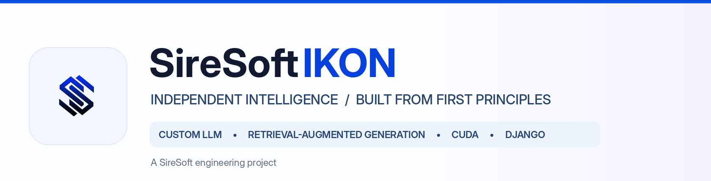
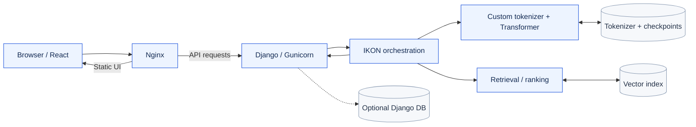
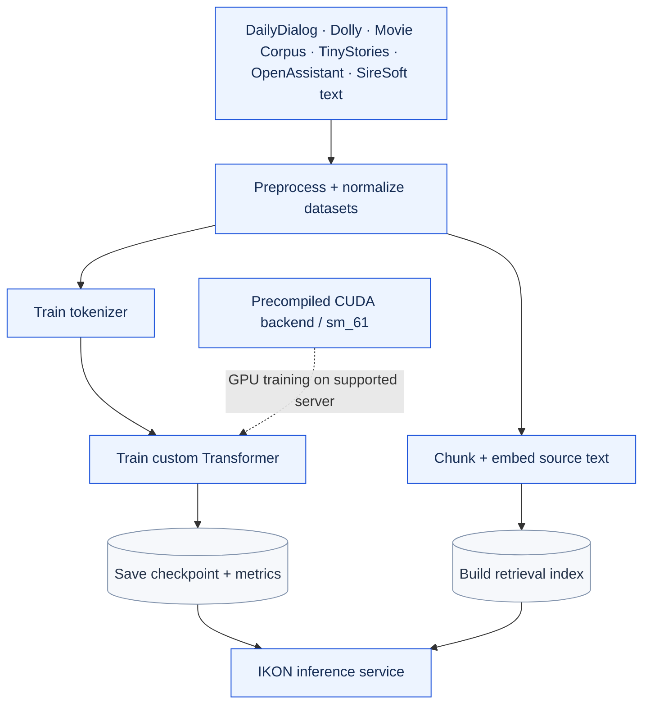
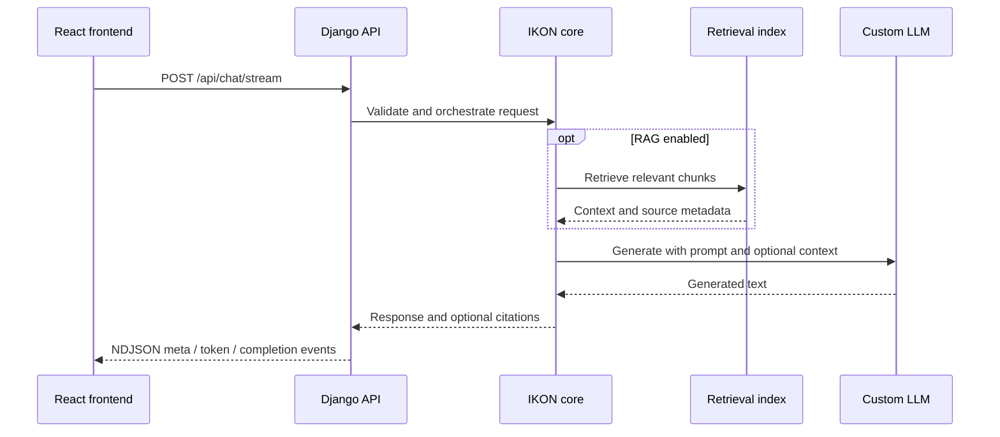
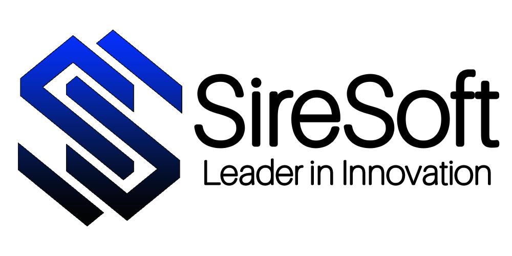

<div align="center">



### SireSoft-IKON v1.0.0

**An independent language-model and retrieval-augmented AI platform, engineered from the ground up.**

[Overview](#overview) · [Architecture](#system-architecture) · [Workflows](#how-ikon-works) · [Getting started](#getting-started) · [Deployment](#production-deployment) · [Tests](#testing)

</div>

---

## Overview

**SireSoft-IKON** is SireSoft's modular AI application, combining a custom Transformer-based language model, a from-scratch tokenizer and training runtime, retrieval-augmented generation (RAG), a Django HTTP backend, and a React web interface.

Its model is trained and served using the project's own model/tokenizer and retrieval implementations, rather than delegating response generation to an external hosted LLM API. The architecture separates **model development**, **retrieval**, **inference**, and **web delivery** so each component can be tested and deployed independently.

| Layer | Implementation |
| :--- | :--- |
| Web application | React 19, TypeScript, Vite, CSS / Tailwind |
| HTTP backend | Django 5.2, Gunicorn (Linux), Nginx reverse proxy |
| Model | Custom Transformer, tokenizer, inference and training modules |
| Retrieval | Document preparation, chunking, embeddings, vector index and ranking |
| GPU training | Custom CUDA kernels; prebuilt Linux `sm_61` backend for the NVIDIA Quadro P5000 |
| Storage | Model checkpoints, tokenizer artifacts, retrieval indexes; optional Django database configuration |
| Quality | Unit, integration, HTTP contract, checkpoint/recovery and CUDA smoke tests |

> **Deployment status:** The source alone is not a trained model. Live inference requires a matching tokenizer, checkpoint, retrieval index, and — for custom CUDA use — its compiled Linux library and metadata.

## Highlights

- **From-scratch language model:** Custom neural-network/Transformer modules, tokenization, batching, training, sampling and checkpoint handling.
- **Retrieval-augmented responses:** Separate retrieval and generation components, with contextual answers and citation metadata when available.
- **Custom CUDA acceleration:** Native GPU kernels covering attention, embeddings, layer normalization, matrix operations, loss and optimizer operations.
- **Django web API:** Stable chat, generation, embedding, retrieval and health endpoints, with NDJSON chat responses.
- **React experience:** Chat interface, conversation history, appearance controls and export utilities.
- **Deployment flexibility:** Local development on Windows/Linux; Nginx and Gunicorn for a supervised Linux deployment.
- **Independent core:** The model/tokenizer/retrieval logic does not rely on third-party hosted LLM services.

## System architecture

The production request path follows SireSoft's standard stack: **Nginx → Django → application code → data/storage**. The browser UI is served by Nginx; API calls are proxied to Django.



**Key boundaries:** Django manages HTTP and request validation; IKON's core handles generation and retrieval; model artifacts and vector indexes remain independent of Django's optional database.

## How IKON works

### 1. Data-to-model workflow



The pipeline builds the tokenizer, trains the language model, saves checkpoints and training metrics, constructs the retrieval index, and verifies the required outputs.

### 2. Chat and RAG workflow



The frontend supports base-model and RAG modes. Chat events are delivered over a streaming HTTP response; the current implementation chunks the completed model reply rather than streaming GPU-generated tokens individually.

## Repository structure

```text
SireSoft-IKON-v1.0.0/
├── .github/workflows/       # CUDA build automation
├── .github/assets/          # README branding
├── configs/                 # Runtime and service configuration
├── deploy/                  # Gunicorn and Nginx examples
├── frontend/                # React / Vite application
│   ├── public/              # Frontend images and brand assets
│   └── src/                 # Components, state and API client
├── ikon_django/             # Django settings, URLs and API views
├── libs/                    # Model and data-processing implementation
│   ├── core/gpu/            # CUDA source and runtime backend
│   ├── neural/              # Layers and activations
│   ├── nlp/                 # Tokenizer and corpus utilities
│   ├── transformer/         # Transformer architecture
│   ├── training/            # Batching, optimizers, training
│   ├── inference/           # Model inference
│   ├── rag/                 # RAG orchestration support
│   └── retrieval/           # Embedding, search and ranking
├── model_store/             # Tokenizer/checkpoint code and artifact paths
├── runtime/                 # Bootstrapping, lifecycle and observability
├── services/                # Modular application services
├── tests/                   # Contracts and integration verification
├── tools/                   # Pipeline, CUDA, tokenizer and test CLIs
├── vector_store/            # Custom retrieval/index implementation
├── app.py                   # Launch Django + Vite in development
├── manage.py                # Django management commands
├── requirements.txt         # Python HTTP dependencies
└── run_pipeline.py          # One-command training pipeline
```

> Directories for local datasets, installed dependencies, build outputs and trained artifacts may be populated separately; they are not all included in source-only archives.

## Getting started

**Prerequisites:** Python 3.10+, Node.js and npm. An NVIDIA GPU is **not required** to develop the Django API or React interface.

### 1. Install dependencies

```bash
python -m venv .venv
# Linux: source .venv/bin/activate
# Windows PowerShell: .venv\Scripts\Activate.ps1
python -m pip install -r requirements.txt
cd frontend && npm ci && cd ..
```

### 2. Start the application

```powershell
# Windows PowerShell
$env:SIREIKON_DEBUG="1"
python app.py
```

```bash
# Linux development
export SIREIKON_DEBUG=1
python app.py
```

| Service | Development address |
| :--- | :--- |
| React web app | `http://localhost:5173` |
| Django API | `http://127.0.0.1:8000` |
| Health check | `http://127.0.0.1:8000/api/health` |

Alternatively, start Django with `python manage.py runserver 127.0.0.1:8000` and Vite with `cd frontend && npm run dev` in separate terminals.

### 3. Validate availability

```bash
python manage.py check
python tests/test_django_http.py
```

```bash
curl http://127.0.0.1:8000/api/health
```

A healthy HTTP response does **not** necessarily mean the trained model is loaded: check `model_ready` and `model_error` before testing real chat replies.

## HTTP API

| Method | Route | Purpose |
| :---: | :--- | :--- |
| GET | `/api/health` | Frontend health and model readiness |
| POST | `/api/chat/stream` | Frontend chat response (NDJSON) |
| GET | `/v1/health` | IKON runtime health |
| POST | `/v1/chat` | RAG-assisted model response |
| POST | `/v1/generate` | Base model generation |
| POST | `/v1/retrieve` | Retrieval index query |
| POST | `/v1/embed` | Text embedding |

The API is served by Django. Some model endpoints return **503** until their trained artifacts are available; that is separate from an HTTP-server startup problem.

## Training and CUDA

Production training defaults to **strict CUDA**: it requires the precompiled backend to work, rather than silently falling back to CPU.

```bash
# Build native CUDA source on a Linux/WSL development machine with CUDA 12.x:
python tools/build_cuda_backend.py --arch sm_61 --required

# On a server with the prebuilt Linux library and Quadro P5000:
python tools/cuda_status.py --arch sm_61
python tools/test_gpu_training.py --arch sm_61 --require-cuda
python run_pipeline.py
```

For development on a machine without NVIDIA hardware, run `python run_pipeline.py --device cpu` **only when the necessary local datasets are available**.

The server-side CUDA library and `libsireikon_cuda.build.json` must match the source; `nvcc` is needed for compilation only, not for loading a compatible prebuilt backend. See [GPU_RUN.md](GPU_RUN.md) and [REAL_RUN.md](REAL_RUN.md).

## Testing

```bash
python manage.py check
python tools/run_tests.py --quick --require-django
python tools/run_tests.py --require-django
```

The test runner covers component, frontend/API contract, Django HTTP, checkpoint and recovery, retrieval, and CUDA backend contract checks. The **strict GPU smoke test** must run on an NVIDIA GPU machine; it cannot be proven on a GPU-less laptop.

## Production deployment

```text
Client / VPN
   ↓
Nginx  (static React build + API reverse proxy)
   ↓
Django / Gunicorn  (one worker for current in-process model cache)
   ↓
IKON LLM + RAG  →  model artifacts / vector store
```

On Linux, install requirements, configure production `DJANGO_SECRET_KEY` and `DJANGO_ALLOWED_HOSTS`, start Django with the configured Gunicorn entry point, and serve `frontend/dist/` behind Nginx. **Keep trained artifacts and the precompiled CUDA library when updating source code.**

Deployment examples are under [`deploy/`](deploy/); detailed guidance is in [DJANGO_DEPLOYMENT.md](DJANGO_DEPLOYMENT.md).

## License and ownership

**Proprietary software — © 2026 SireSoft. All rights reserved.**

This repository is intended for SireSoft and authorized collaborators. No permission to copy, modify, redistribute, or commercially use the software is granted by this README. Refer to SireSoft's applicable written licensing and ownership terms.

<div align="center">

---



<sub>Engineered for SireSoft · SireSoft-IKON v1.0.0</sub>

</div>
